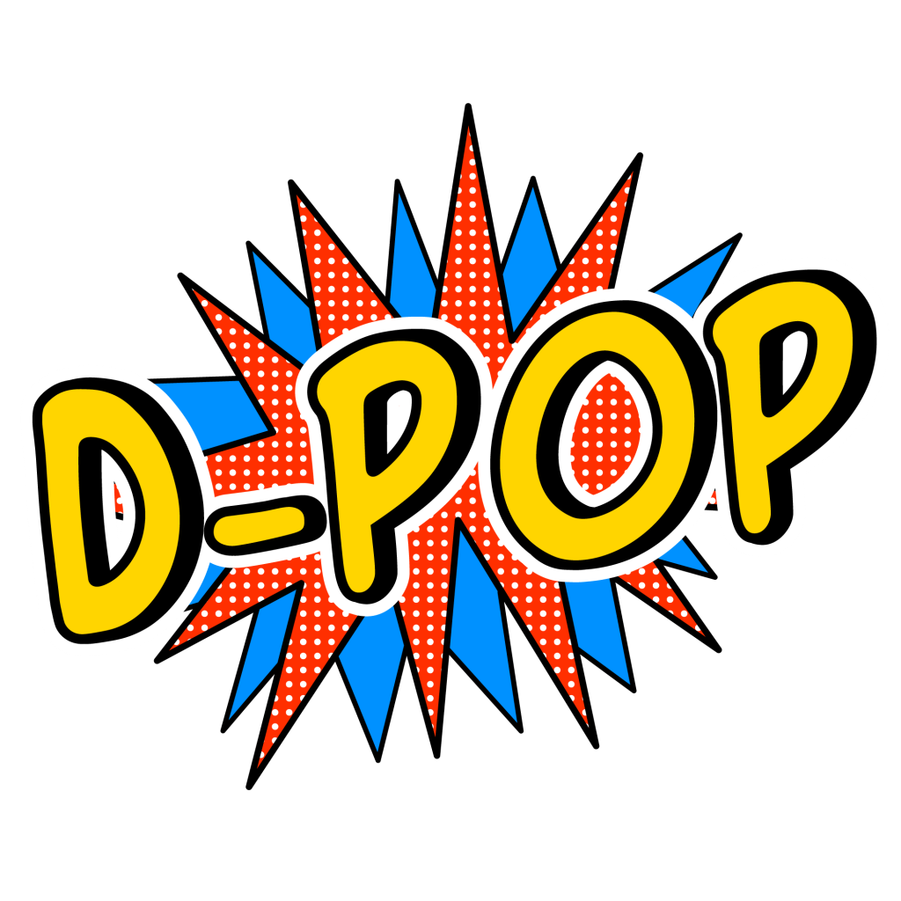

D-Pop er et landsdækkende arrangement i holdbaseret problemløsning og programmering med fokus på nybegyndere.

Den primære målgruppe er hold af tre personer, som har grundlæggene færdigheder i programmering.
(Se [hvad skal man kunne?](deltager/#hvad-skal-man-kunne))
Men D-Pop er åbent for alle.
Der skal være noget at tænke over, lære, og blive dygtigere på, uanset forudsætninger.

# D-Pop 2022

D-Pop 2022 sker fredag, d. 22. april 2022, som del af [Forskningens Døgn 2022](https://forsk.dk).

* Årets _opgaver_ vil være tilgængelige på [dpop22.kattis.com](https://dpop22.kattis.com) fredag, d. 22. april 2022, kl. 16-18.
* Nynne Grauslund Kristiansen er projektleder og står får den organisatoriske del af D-Pop.
* Problemkomitéen er Alice Ryhl, Asger Hautop Drewsen, Oskar Haarklou Veileborg, Troels Bjerre Lund og Thore Husfeldt (formand).

Se også [tidligere D-Pop](tidligere).

# Deltag

Find nogle venner, medstuderende, klassekammerater eller kolleger.
I kan forberede jer, hvis I har lyst.
Du må også gerne deltage alene.

Læs mere på [deltager](/deltager/).

# Bliv d-popstjerne

I stedet for selv at deltage selv kan du _hjælpe andre_ videre under D-Pop.
Du får problemerne på forhånd, sammen med vejledningsmateriale, og kan forberede dig.
Perfekt for viderekomne studerende eller lærere.

Læs mere på [stjerne](/stjerne/).

# For lærere

Er du lærer i programmering?
Du kan bruge D-Pop som undervisningsaktivitet, projekt eller åbent hus på datalogiinsitutterne.
Din klasse eller dit hold (eller din projektgruppe) er _deltagere_.
Du kan 
* selv være D-popstjerne: Så får du opgaverne i forvejen og kan hjælpe dine egne elever under arrangementet. (Du kan også bruge materialet efter arrangementet. Retningssystemet forbliver åbent. Der er stof til et hav af projekter.)
* få knyttet en dpopstjerne til dit hold. Med lidt held kan vi finde nogen som kan din klasses programmeringssprog eller som er fra jeres lokale universitet, hvis nu eleverne overvejer at læse videre. Så kan I snakke studier med en ældre studerende. 
* ikke gøre noget særligt. Bare mød op som deltager på lige fod med alle andre.

---

<a href="https://github.com/d-pop/d-pop.github.io">Kildekode</a>.

Licens: CC BY-NC-SA, se <a href="/license">here</a>.

