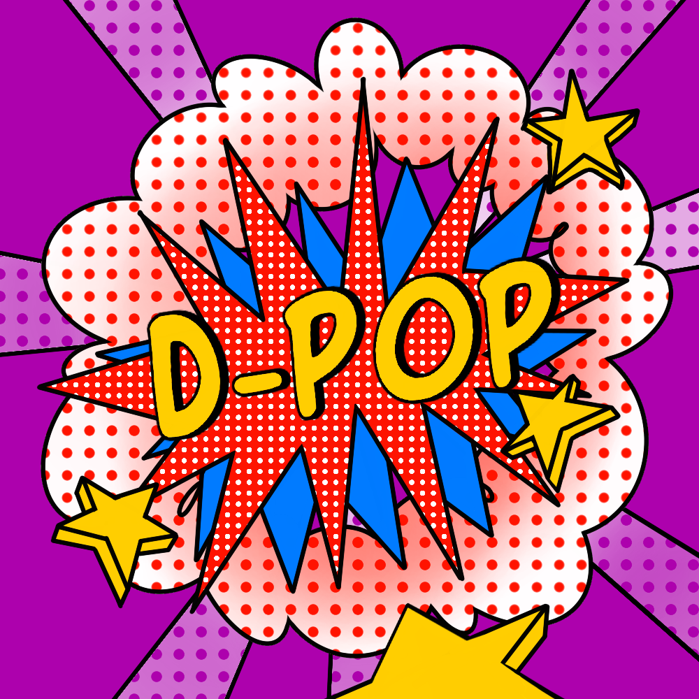

D-Pop er et landsdækkende arrangement i holdbaseret problemløsning og programmering.
Den primære målgruppe er hold af tre personer, som har gennemået hvad der svarer til et grundkursus i programmering, fx på en ungdomsuddannelse eller et universitet, eller ved egen hjælp.
Men D-Pop er åbent for alle, og der skal være noget at tænke over, lære, og blive dygtigere på for alle deltagere.

# D-Pop 2020

D-Pop 2020 finder sted fredag d. 24. april 2020 kl. 15–18.
Vi har en (ufuldstændig) liste af [lokale arrangementer](/arrangementer/).

Problemerne vil være tilgængelige på dpop2020.kattis.com.

# Deltag

Find to venner, medstuderende, klassekammerater eller kolleger og mød op på et af de lokale arrangmenter, eller vær med hjemmefra. 
Læs mere på [deltager](/deltager/).

# Bliv vært

Du kan blive vært for et lokalt D-Pop-arrangement, fx på dit gymnasium eller på din arbejdsplads, hvad enten det er for 5 eller 100 deltagere, for dine venner, elever, medkollegianere eller kolleger.
Åbent for eller for en lille kreds.
Det skal være nemt at blive vært og kræver bare nogle borde og internetadgang for deltagerne.
Læs mere på [vært](/vært/).

# Bliv d-popstjerne

I stedet for selv at deltage selv kan du hjælpe andre videre under dit lokale D-Pop-arrangement.
Så får du nogle af problemerne på forhånd, sammen med vejledningsmateriale, og kan forberede dig.
Og en poppet t-shirt, så du er synlig.
Perfekt for viderekomne studerene eller lærere.
Læs mere på [stjerne](/stjerne/).

---

<a href="https://github.com/d-pop/d-pop.github.io">Kildekode</a>.

Licens: CC BY-NC-SA, se <a href="/license">here</a>.

